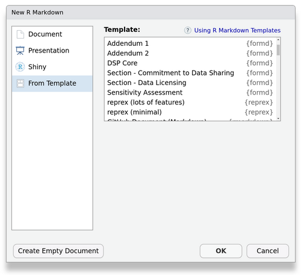

## FoRmd: Form templates with Rmarkdown

This package intends to provide:

- A reusable collection of form components, currently focused on collecting project intake and governance info.
- Utils for creating web forms so that functional forms can be customized from templates or from scratch.
- A place for Sage projects to share other reusable documents. 

### Development Notes

- New governance forms (DUO+ initiatve) are in development.
- This is being incubated in the NF-OSI project. 
At some point, when stable and useful enough, we plan to have this be under [Sage-Bionetworks](https://github.com/Sage-Bionetworks/).

### Alternatives

You should be aware of alternatives and consider your use case. 

For Data Sharing Plans, consider [DMPTool.org](https://www.dmptool.org).

For more general (and also more expensive) solutions: [DocuSign](https://www.docusign.com/) and [Jotform](https://www.jotform.com/).

This currently provides several free and open-source well-thought-out yet still-customizable forms for specific use cases (starting with DSPs). 
It isn't meant for PHI collection. 

### Installation

`remotes::install_github('nf-osi/formd')`

### Usage

#### Templates

(Requires `rmarkdown` >= 2.14)

**To see available templates:**  
`rmarkdown::available_templates(package = "formd")`

**To import all templates for a "standard" DSP document:**  

`formd::draftStandardDSP(version = "v1")`  
(here, an older version is specified, but if not specified this will default to the most current version)  

This creates a folder 'DSP_Standard_v1' in the current working directory, which contains a bundle of docs for a DSP.
Drafting a DSP in this manner is like ordering a _prix fixe_ menu.
You can then change the parameters in the _main_ document, i.e. DSP_Standard_v*.Rmd.

Generally, to customize a template to fit the needs of your project:

- Change parameters such as `fundingAgency` to reference the actual project funding agency in the _main_ document.
- Tweak the wording if needed in the _child_ template docs.
- Remove or add form inputs in the _child_ template; a `*_config.yml` file defines inputs if there are inputs for that template.

Forms are modularized so that they can be hosted on separate web pages or concatenated into a single web page.
Again, the above describes how to make a DSP form the _prix fixe_ way, but you may alternatively wish to build your DSP form _a la carte_.
For example, you may want to import only one component template, the DSP_Core, write totally different custom sections, and then compose your own final DSP_Main document.
In that case, just import using `rmarkdown::draft("DSP_Core", template = "DSP_Core", package = "formd")` into your draft working directory (or use the RStudio UI as below).

##### RStudio

If using RStudio, templates can be accessed via _New File > Rmarkdown..._

For more about templates (if you've never used them), see [RStudio - Rmarkdown Templates](https://rstudio.github.io/rstudio-extensions/rmarkdown_templates.html).

### Form Input Builder Utils

To customize the form inputs for an existing template or a from-scratch document, you should understand how the `*config.yml` documents work.
The "DSP Core" template is the best example of what inputs are available and how to compose them (see `dsp_core_config.yml`). 

### Questions

- **Which form backend should I use/does this work with?** We use formspark.io. 
There are a multitude of good form backends, though you may need to preprocess your JSON data to make PDF generation work correctly. 
- **Can this be used with PHI?** That actually depends on your form backend and where you are putting your form. But this was really originally intended for better low-throughput administrative data collection, so it is not really recommended. 
- **You said this could be 'A place for Sage projects to share other reusable form documents'? What can I contribute?** Possibly any generalizable community surveys or data reports.

